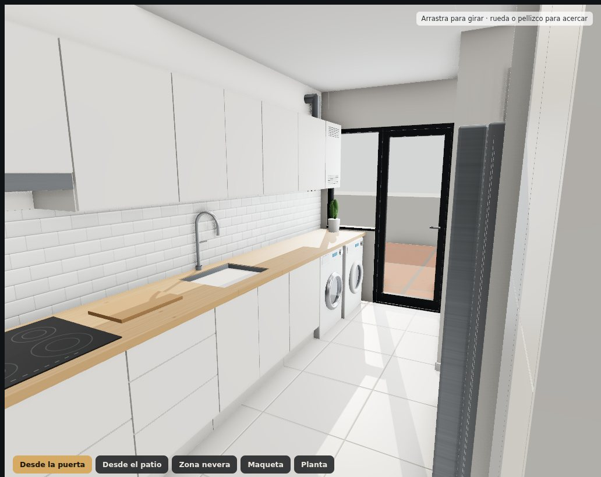
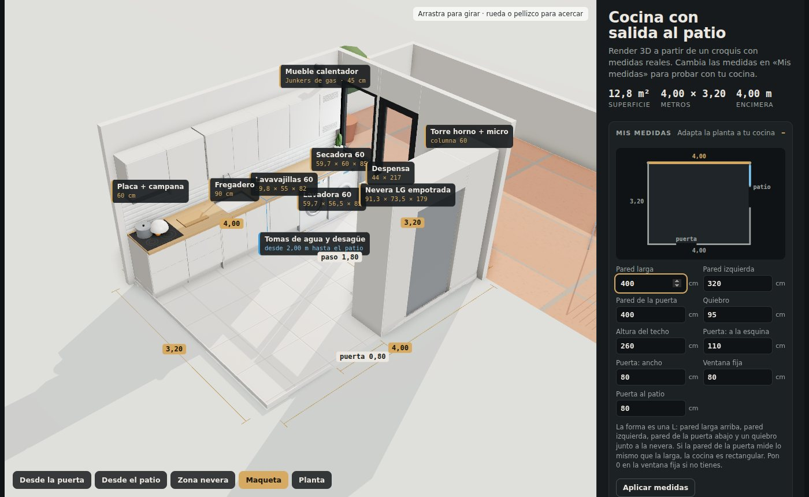
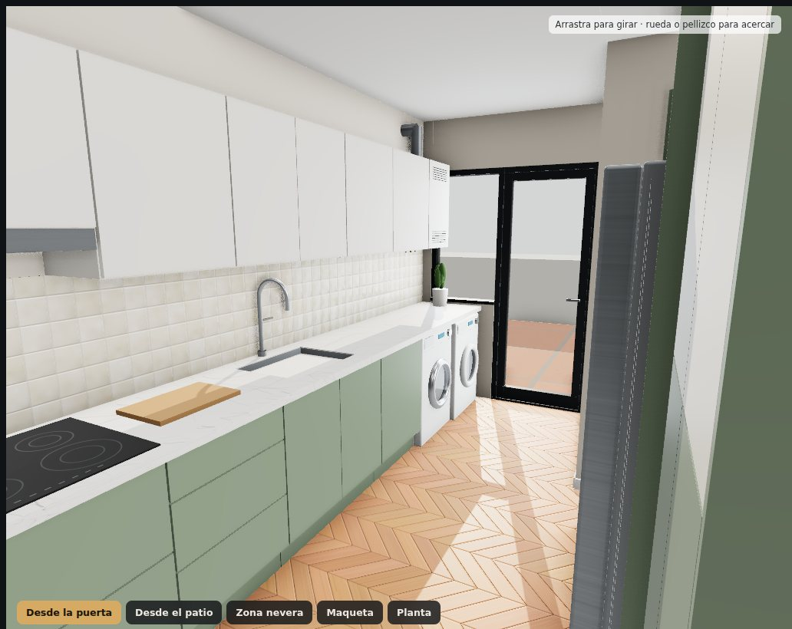
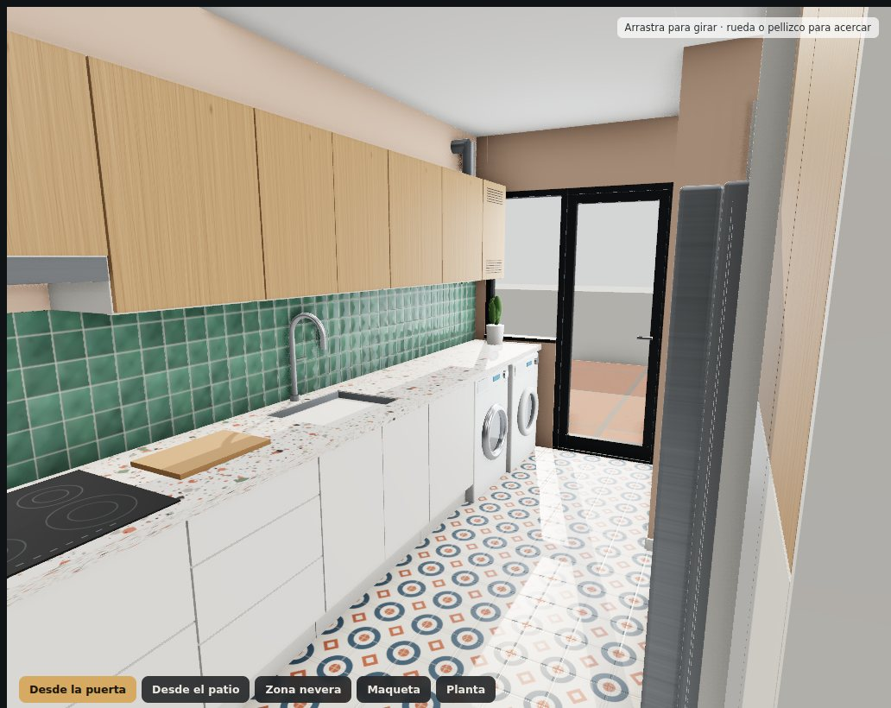
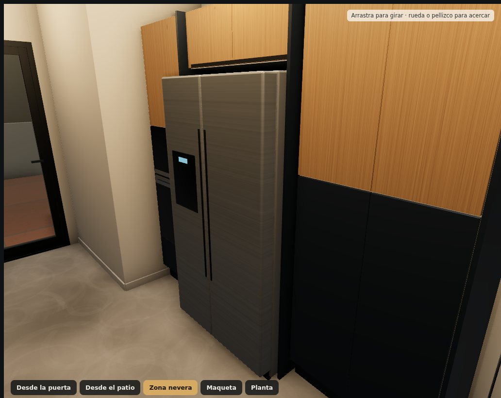
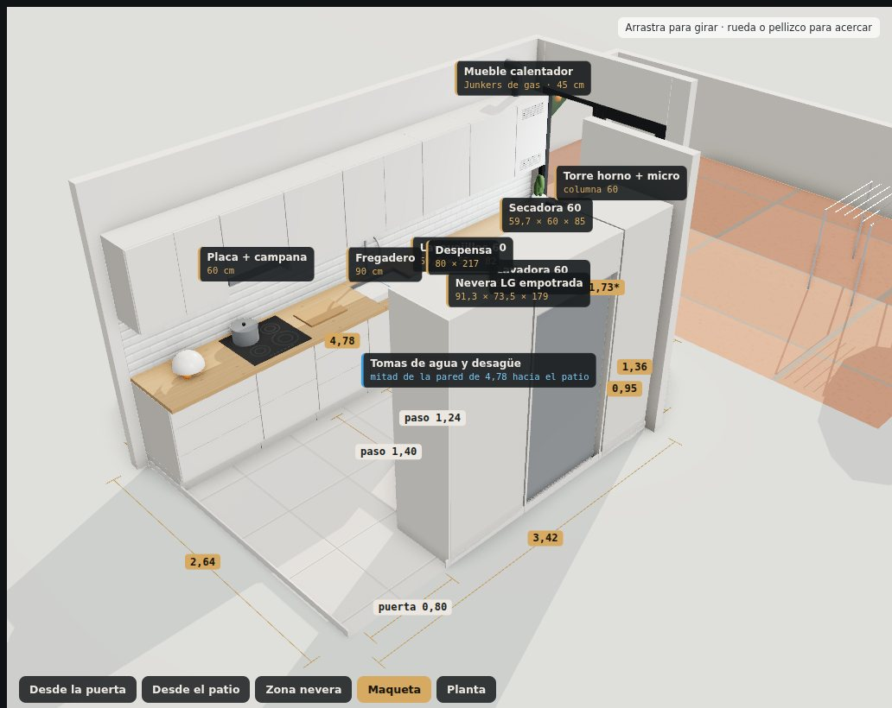
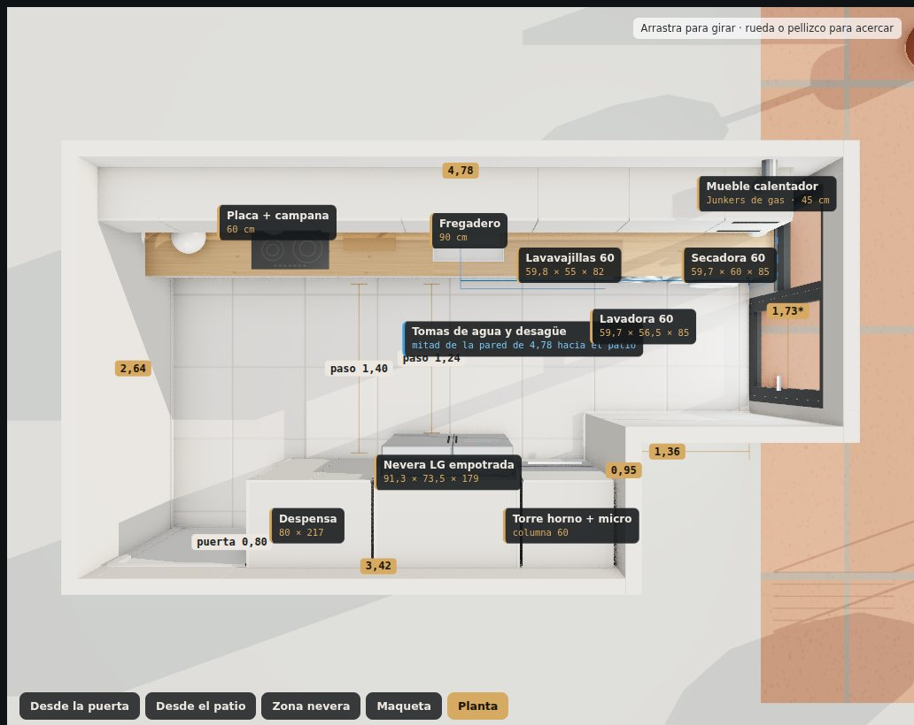

# Cocina 3D

[](https://github.com/RicardoEdreiraPenas/cocina-3d/actions/workflows/pages.yml)

Hice este configurador para diseñar la cocina de mi casa en Albuixech. Es una cocina de 4,78 × 2,64 m con salida al patio, y quería ver cómo quedaba antes de encargar nada. Funciona en el navegador y parte del croquis que dibujé a mano con las medidas reales. Con él pruebo distribuciones, coloco electrodomésticos de tamaño estándar, cambio acabados y compruebo que todo cabe.

Lo comparto por si a alguien le sirve para diseñar la suya. Desde «Mis medidas» puedes meter las de tu cocina y ver cómo se reparten los muebles.

Puedes probarlo aquí: https://ricardoedreirapenas.github.io/cocina-3d/



## Qué hace

- En «Mis medidas» cambias las paredes, la altura del techo, la puerta de entrada, la ventana fija y la puerta al patio. Un plano pequeño se va dibujando mientras escribes y, al aplicar, la cocina se rehace: los muebles se reparten solos en módulos de 60, 45, 40 y 30 cm, y el panel avisa de lo que no cabe. Si la pared de la puerta mide lo mismo que la larga, la planta es rectangular.
- En el mismo sitio puedes poner las medidas de tus electrodomésticos: ancho, fondo y alto de la nevera, la lavadora y la secadora, y el ancho del lavavajillas y de la placa. Los huecos se ajustan y el panel avisa, por ejemplo, si la lavadora no entra bajo la encimera o si la nevera sobresale del quiebro.

  

- Tiene tres distribuciones sobre la misma planta. En L, lineal con columna de lavado y otra que llamo "aguas al patio", que junta fregadero, lavavajillas, lavadora y secadora encima de las tomas de agua.
- La nevera americana (una LG side-by-side de 91,3 × 73,5 × 179 cm) se puede poner en dos sitios. Empotrada entre la despensa y la torre de hornos, o en el hueco del quiebro.
- Para los acabados hay 4 opciones actuales en cada categoría y 4 estilos combinados que se aplican con un clic.

  | Categoría | Opciones |
  |---|---|
  | Muebles bajos | Blanco roto · Verde salvia · Azul noche · Roble natural |
  | Muebles altos | Blanco roto · Verde salvia · Azul noche · Roble natural |
  | Encimera | Roble macizo · Cuarzo Calacatta · Porcelánico negro mate · Terrazo |
  | Frente de cocina | Metro blanco · Zellige verde · Zellige crema · Igual que la encimera |
  | Pintura de pared | Blanco cálido · Greige · Arcilla · Verde niebla |
  | Suelo | Porcelánico 60×60 · Roble en espiga · Microcemento · Hidráulico |

- Se puede ver de día y de noche. De día entra el sol por la ventana y la luz del cielo por la puerta del patio. De noche están los focos del techo y las tiras LED bajo los muebles altos.
- En calidad alta usa oclusión ambiental (GTAO), sombras de 4096 px y bloom por la noche. En el móvil arranca en modo rápido.
- Comprueba medidas que me importaban: pasos libres, apertura de puertas, triángulo de trabajo, distancia a las tomas de agua y ventilación de la nevera y del calentador de gas. Todo se recalcula con tus medidas.
- Hay cinco vistas (desde la puerta, desde el patio, nevera, maqueta y planta). También muestra las cotas del croquis y las puertas se abren con animación.
- El diseño se guarda en la URL, así que puedes pasar el enlace a quien quieras. Por ejemplo `#C.pared.000000`, y si has cambiado las medidas también van dentro: `#C.pared.000000.m360-300-360-95-260-120-80-64-80`. Las de los electrodomésticos se añaden detrás con `.a` (en milímetros).
- Con «Guardar imagen» te descargas la vista que tengas en pantalla en PNG, a unos 2400 px de ancho. Es lo que uso para enseñárselo al carpintero.

| Salvia | Mediterráneo | Noche |
|---|---|---|
|  |  |  |

| Maqueta | Planta |
|---|---|
|  |  |

## Cómo usarlo en local

No hay que instalar nada. Eso sí, los módulos JavaScript necesitan un servidor, así que abrir `index.html` con doble clic no funciona. Yo lo lanzo así:

```bash
python3 -m http.server 8000
# abre http://localhost:8000
```

Si prefieres un único HTML con todo dentro, que sí se abre con doble clic, puedes generarlo con:

```bash
python3 scripts/build_single.py   # → dist/cocina-3d.html
```

## Cómo adaptarlo a tu cocina

Lo más rápido es «Mis medidas», en la propia web. Si quieres que tu cocina sea la que se abre por defecto, o cambiar algo más, todo está en [`js/config.js`](js/config.js):

- `DEFAULT_ROOM` son las medidas de partida, en metros: pared larga, pared izquierda, pared de la puerta, quiebro, techo, puerta de entrada, ventana fija y puerta al patio.
- `WATER` marca dónde empiezan las tomas de agua y `BOILER` el mueble del calentador (se puede desactivar).
- `DEFAULT_APPLIANCES` tiene las medidas de partida de la nevera, el lavavajillas, la lavadora, la secadora y la placa, y `APPLIANCE_LIMITS` los márgenes que acepta el formulario.
- `CATALOG` y `PRESETS` son los acabados y los estilos. Para añadir un color solo hay que meter otra entrada `{ id, name, type: 'color', color: '#...' }`.

Los muebles se reparten en `buildLayout()`, dentro de [`js/main.js`](js/main.js). Cada distribución dice qué módulos van pegados al principio y cuáles al final de la pared (por ejemplo `I('dw', 0.60, 'dw')` es un lavavajillas de 60 cm), y `packRun()` rellena el hueco del medio. Los textos del panel salen de [`js/info.js`](js/info.js), calculados con las medidas.

Las texturas (maderas, piedras, azulejos) las dibujo por código en [`js/textures.js`](js/textures.js), así el proyecto no depende de imágenes externas. Se generan cuando hacen falta, para que la web cargue antes en el móvil.

## Publicarlo con GitHub Pages

El repositorio ya trae el flujo [`.github/workflows/pages.yml`](.github/workflows/pages.yml), que publica la web en cada `push` a `main`. Para activarlo:

1. En GitHub, ve a **Settings → Pages**.
2. En **Build and deployment → Source**, elige **GitHub Actions**.
3. Haz `push` a `main`. En la pestaña **Actions** verás el despliegue y, cuando termine, la URL pública.

## Pruebas

Antes de publicar, GitHub Actions abre la web en un Chromium sin ventana y comprueba que carga sin errores, que la escena se dibuja en todas las distribuciones y estilos, que el panel sale completo, que «Guardar imagen» funciona y que «Mis medidas» rehace la cocina con otra planta. Si algo falla, no se publica.

Para lanzar la misma prueba en tu ordenador:

```bash
npm install
npx playwright install chromium
python3 -m http.server 8000 &
npm test
```

## Estructura

```
index.html              página y panel
css/styles.css          estilos
js/config.js            medidas, electrodomésticos, catálogo de acabados
js/info.js              textos del panel: electrodomésticos y comprobaciones
js/textures.js          texturas procedurales
js/main.js              escena 3D, distribuciones, luces, interfaz, «Mis medidas»
vendor/three/           three.js 0.165 y los complementos que uso
scripts/build_single.py genera dist/cocina-3d.html
tests/smoke.mjs         prueba en navegador que se lanza antes de publicar
docs/                   capturas e imagen para compartir el enlace
favicon.svg             icono de la pestaña
```

## Tecnología

Uso [three.js](https://threejs.org/) 0.165 con postprocesado (GTAO, UnrealBloom), luces de área y etiquetas CSS2D. Va copiado en `vendor/three`, así la web no depende de ningún CDN. No hay paso de compilación; npm solo se usa para la prueba automática.

## Aviso

Esto sirve para visualizar, no sustituye a un profesional. Antes de encargar muebles o electrodomésticos, confirma las medidas en obra y los requisitos de instalación de cada fabricante. Sobre todo la ventilación de la nevera y las distancias del calentador de gas, que tiene que validar un instalador autorizado.

## Licencia

[MIT](LICENSE) © 2026 Ricardo Manuel Edreira Penas
